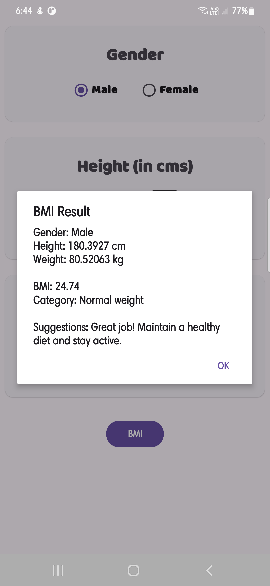
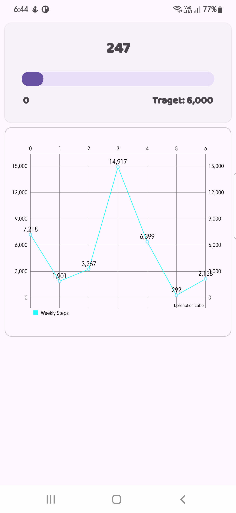

# Fitness Tracker App

An Android app designed to help users monitor and achieve their fitness goals. Developed by Shivesh and Harshal, this app offers step tracking, a BMI calculator, and weekly fitness progress charts, providing a comprehensive fitness companion for users.

---

## Features

- **Step Tracking**  
  Displays the user's current steps against a 6,000-step daily goal. Includes a visual progress bar to track goal completion in real-time.

- **BMI Calculator**  
  Allows users to input gender, height, and weight to calculate their Body Mass Index (BMI), displaying a categorized result with suggestions for improvement or maintenance.

- **Weekly Step Chart**  
  A weekly visual representation of step data, helping users monitor their activity levels and track fitness trends over the week.

---

## Screenshots

### Home Screen - Step Tracking  
Displays the user's steps, goal, and progress in a clean, minimal layout.


### BMI Calculator  
Select your gender, input height and weight, and get an instant BMI result with categorized health suggestions.



### Weekly Step Chart  
A graphical view of the past week's steps, allowing users to track their fitness trends and set new goals.


---

## Getting Started

### Prerequisites
- **Android Studio** - Install [Android Studio](https://developer.android.com/studio) to run the app.
- **Google Play Services** - Make sure Google Play Services is up to date, as the app integrates with Google’s fitness APIs.
- **API Key** - Configure Google API permissions for fitness tracking.

### Installation

1. Clone the repository:
    ```bash
    git clone https://github.com/yourusername/fitness-tracker-app.git
    ```

2. Open the project in Android Studio.

3. Set up your Google API Key for Fitness APIs in `AndroidManifest.xml`.

4. Build and run the app on an Android device with step-tracking capabilities.

---

## Usage

### Step Tracker
- Open the app to see your daily step count.
- The progress bar displays the percentage of the goal achieved (6,000 steps default).

### BMI Calculator
- Access the BMI calculator via the bottom navigation.
- Input your details to get BMI results and suggestions.

### Weekly Step Chart
- View your step trends by day using the built-in weekly chart feature.

---

## Code Structure

- **MainActivity.kt** - Home screen with step tracking and navigation.
- **StepTracker.kt** - Manages step tracking and data retrieval from Google Fitness API.
- **BmiActivity.kt** - Handles the BMI calculation and displays results with recommendations.
- **StepActivity.kt** - Displays the weekly step count data in a line chart.
- **activity_main.xml, activity_bmi.xml, activity_step.xml** - Layout files for main activities.

---

## Contributing

We welcome contributions! Please submit a pull request or open an issue for any bugs, enhancements, or new features.

1. Fork the repository
2. Create your feature branch (`git checkout -b feature/new-feature`)
3. Commit your changes (`git commit -m 'Add new feature'`)
4. Push to the branch (`git push origin feature/new-feature`)
5. Open a pull request

---

This README provides a full overview of the Fitness Tracker App’s features, installation steps, and contribution guidelines. Enjoy using and developing the app!
